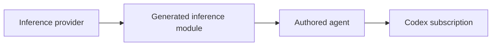

# Intent of the change

Allow an OpenBot installation to use an authenticated Codex subscription as its inference source while retaining Vercel AI Gateway support.

# Architecture changes

ADR-0004 and ADR-0011 retain provider ownership of credential readiness, template contribution, and deployment artifact handoff. Authored agents import the generated inference module directly.

# Summarized package changes

- `@tryopenbot/inference-provider`: Codex provider and Vercel template handoff.
- `openbot`: initialization, development, and deployment integration.
- workspace packages: AI SDK 7 migration and explicit tool result types.

# Critical to apply to forks

Yes. Forks must regenerate or migrate authored-agent inference modules and install the lockfile's platform-compatible Codex binary before selecting Codex subscription inference.

