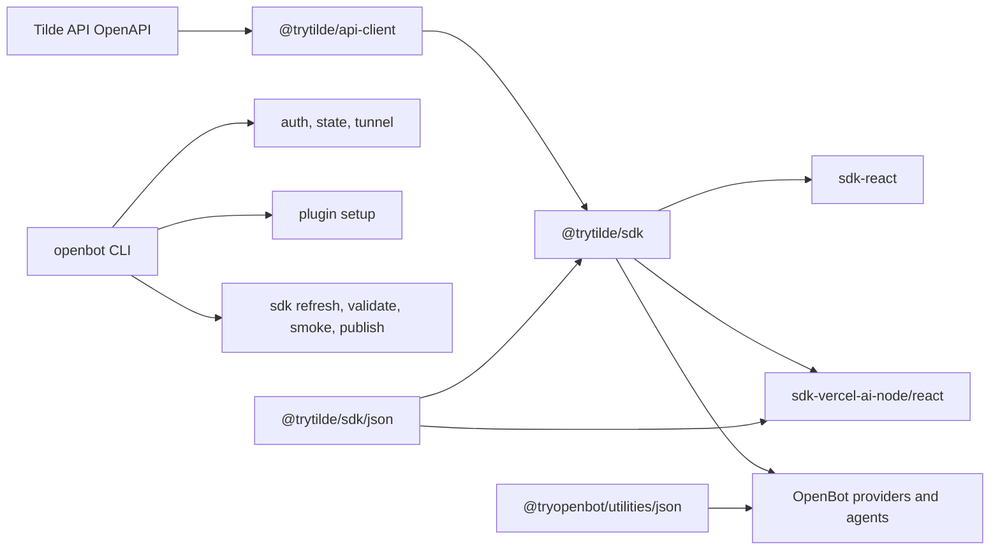

# Intent of the change

One open-source codebase. Keep OpenBot name. Fold `trytilde/harness-sdk` source into OpenBot.

- Remove cross-repo SDK release/pin dance.
- Rename public packages from Harness language to `@trytilde/sdk*`.
- Keep generated Tilde API client beside hand-authored wrappers and real OpenBot consumers.
- One `openbot` command surface. No second CLI. No plugin helper package.
- Shared JSON guards/accessors. No repeated `isRecord`, `isJsonObject`, `stringField` helpers at call sites.

# Architecture changes

Tilde API remains external contract authority. OpenBot repository now owns generated TypeScript
client, stable SDK wrappers, framework adapters, and all operator/developer CLI workflows.

- New workspace directories: `packages/api-client`, `packages/sdk`, `packages/sdk-react`,
  `packages/sdk-vercel-ai-node`, `packages/sdk-vercel-ai-react`.
- New public names: `@trytilde/sdk`, `@trytilde/sdk-react`,
  `@trytilde/sdk-vercel-ai-node`, `@trytilde/sdk-vercel-ai-react`.
- Existing `@trytilde/api-client` moves from Git SHA dependency to workspace ownership.
- Old `@trytilde/harness-sdk*`, `@trytilde/cli`, `tilde`, and `t` surfaces removed here. No shim.
- `openbot auth|state|tunnel` owns core Tilde operations. `openbot plugin` owns coding-agent MCP and
  skill-registry setup. `openbot sdk` owns SDK lifecycle; publication requires `--yes`.
- SDK versions stay outside OpenBot fixed Changesets group. ADR-0002 amended. ADR-0030 added.
- Legacy auth and tunnel state remains readable. New writes use Harness-free paths.
- Public SDK never depends on `@tryopenbot/*`. SDK JSON helpers live at `@trytilde/sdk/json`;
  OpenBot-only helpers live at `@tryopenbot/utilities/json`.

# Summarized package changes

- `@trytilde/api-client`: generated OpenAPI client, stable config/path helpers, 375-operation
  validation, package docs, build and pack validation.
- `@trytilde/sdk`: core client, ChatKit, MCP, skill packages, reverse proxy, JSON utility subpath,
  unit and credentialed E2E harness.
- `@trytilde/sdk-react`: provider and ChatKit history/event hooks.
- `@trytilde/sdk-vercel-ai-node`: signed ChatKit/tool endpoints, Vercel AI message conversion,
  attachment handling, authenticated MCP client.
- `@trytilde/sdk-vercel-ai-react`: Vercel UI endpoint hook plus React SDK re-exports.
- `openbot`: imports all former Tilde CLI behavior; adds `auth`, `state`, `tunnel`, `plugin`, and
  `sdk` commands; keeps one interactive launcher/help inventory.
- `@tryopenbot/agent-provider`, `git-provider`, `platform-integrations`, `computer-tools`: workspace
  SDK imports replace registry and Git SHA Harness dependencies.
- `@tryopenbot/utilities`: domain-neutral JSON types, guards, string accessors, and non-throwing
  parser exposed through `@tryopenbot/utilities/json`.
- `@tryopenbot/connector-tools`, `computer-tools`, `computer-service`: repeated record guards removed;
  shared utility subpath used.
- Repository SDK skills: OpenAPI refresh, stable wrapper addition, intentional API exposure loop.
- Changeset: breaking import/CLI migration documented.
- Validation: `pnpm check`, `pnpm build`, complete package tests, 164 CLI tests, 128 Tilde package
  tests, packed clean-consumer smoke, package artifact verification, CLI artifact verification.
- Live `TILDE_E2E=1` not run. Requires external credentials and creates remote fixtures.

# Critical to apply to forks

yes

Forks must migrate authored imports and automation:

- Replace `@trytilde/harness-sdk` with `@trytilde/sdk`.
- Replace framework adapters with corresponding `@trytilde/sdk-*` names.
- Replace standalone `tilde auth|state|tunnel` commands with `openbot auth|state|tunnel`.
- Replace coding-agent wrapper binaries or `@trytilde/harness-plugins` with `openbot plugin`.
- Run `pnpm install`, `pnpm check`, and `pnpm build` after merging so workspace links and generated
  SDK artifacts resolve from their new directories.

No fork configuration, secret, provider resource ID, HTTP route, ConnectRPC contract, Vercel route,
mobile capability, desktop capability, or web capability changes. Existing encrypted CLI auth and
tunnel connector state migrates through compatibility reads.
