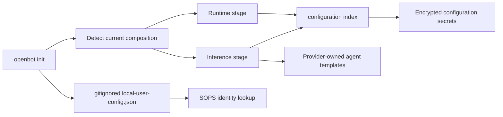

# Intent of the change

Make `openbot init` safe to resume after partial setup and explicit about independent runtime and inference choices.

- Store local SOPS lookup metadata beside one checkout, not in a shared home-directory file.
- Detect current built-in provider composition before prompting.
- Re-run only provider stages whose selection changed.
- Migrate provider-owned agent template files only when they still match the old provider template.
- Stop with a preservation error when a fork changed a template that automatic migration would replace.

# Architecture changes

Initialization now separates portable repository configuration, encrypted secret data, and checkout-local operator control state.

- `local-user-config.json` is the single checkout-local location for the owner's SOPS identity lookup metadata.
- Runtime and inference providers are selected independently, including Codex inference with either local or Vercel runtime.
- Provider migration prepares replacements before writing them and compares tracked template contents with the previous built-in provider source.
- Provider lifecycle ordering and repository-owned `configuration/` composition remain unchanged.

# Summarized package changes

- `openbot` CLI: detects the current provider group, resumes incomplete setup, prompts per changed provider domain, writes checkout-local user configuration, and safely prepares inference template migration.
- `@tryopenbot/inference-provider`: exposes stable provider-owned template contributions used for comparison and migration.
- `@tryopenbot/configuration`: documents the checkout-local user configuration contract.
- Repository docs: describe resumable initialization and amend ADR-0007 with the new control-state boundary.
- Root ignore rules: exclude `local-user-config.json` from version control.
- Changeset: expands the Codex inference release note to cover switching and checkout-local initialization state.
- Validation: 40 focused initialization and inference tests passed; `pnpm check` passed with upstream warnings only; the complete reconciled branch passed `pnpm build`.

# Critical to apply to forks

yes

Fork operators must rerun `openbot init` after merging. If an older `~/.openbot/config.json` supplied SOPS lookup metadata, choose or confirm that identity so OpenBot writes the new checkout-local `local-user-config.json`. Do not commit that file.

Before switching inference providers, preserve any fork-owned edits in provider template targets. Automatic migration proceeds only when those files still match the previous built-in provider template; otherwise initialization stops and names the conflicting path.

No environment variable names, encrypted secret keys, HTTP routes, ConnectRPC contracts, deployment topology, or `configuration/` ownership rules change. Customized forks should run focused initialization tests, `pnpm check`, and `pnpm build` after merging.
