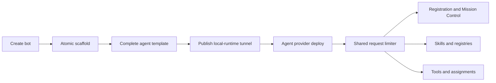

# Intent of the change

Prevent half-created bots and slow serial Tilde reconciliation.

- Finish the complete repository template before exposing a new bot through the local-runtime tunnel.
- Roll back incomplete lifecycle state when creation fails.
- Reconcile independent external resources concurrently.
- Apply one bounded request ceiling across generated API, skill, and tool clients.
- Make managed skill registry and tool assignment updates converge cleanly on repeated deploys.

# Architecture changes

Bot creation now has a durable local boundary before external visibility, and one provider-owned limiter governs all Tilde reconciliation traffic.

- CLI lifecycle code owns filesystem atomicity and cleanup.
- The agent provider owns external identity, registration, Mission Control, skills, and tools.
- A shared fetch limiter caps concurrent Tilde requests at ten while preserving ordered results and error context.
- Provider contracts, resource identity, and lifecycle phase ownership do not change.

# Summarized package changes

- `openbot` CLI: stages complete agent templates before lifecycle publication, preserves explicit rollback, and passes avatar/template inputs through one atomic creation path.
- `@tryopenbot/agent-provider`: shares bounded fetch across clients, runs independent post-identity reconciliation concurrently, preserves PR 74's refreshed managed Cua identifiers, and adds race-safe authored skill adoption without overwriting user-owned collisions.
- `@tryopenbot/platform-integrations`: accepts the bounded fetch implementation without changing its public connection authority.
- Changeset: records the fixed-group patch behavior.
- Validation: after rebasing across PRs 74-76, 30 focused CLI and agent-provider tests passed and `pnpm check` passed with 36 upstream warnings and no errors. The complete reconciled branch passed build and browser checks.

# Critical to apply to forks

yes

Forks that create or deploy bots should merge this change to avoid publishing an agent before its local template is complete and to prevent serial or unbounded Tilde reconciliation. No manual data migration is required.

Custom agent-provider adapters keep their existing contracts. Forks with modifications around CLI agent creation should preserve the new ordering: atomic scaffold first, tunnel publication second, external reconciliation last. Run focused CLI lifecycle and provider idempotency tests after merging.

No secret name, environment name, provider resource identifier, HTTP route, ConnectRPC contract, deployment topology, or `configuration/` ownership changes.
