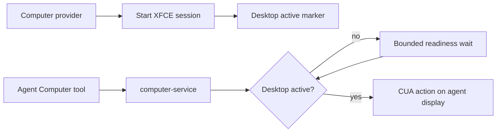

# Intent of the change

Stop Computer actions from racing the graphical desktop session.

- Distinguish a running computer-service process from an active agent desktop.
- Wait for the agent-specific display before dispatching CUA input.
- Report desktop readiness consistently through existing Computer tool results.
- Preserve the current display routing, per-agent authorization, and service lifecycle.

# Architecture changes

Desktop readiness remains ephemeral computer-service state and is established by the provider-owned desktop session.

- The computer-service provider creates and removes readiness state with the managed desktop session.
- Computer-service checks the authenticated agent's display rather than a process-global desktop assumption.
- Computer tools expose readiness through their existing typed result without adding a new RPC.
- No renderer, provider selection, or sandbox authorization boundary changes.

# Summarized package changes

- `@tryopenbot/computer-service-provider`: desktop session template records active readiness and cleans it up on exit.
- `@tryopenbot/computer-service`: validates display readiness, waits before CUA dispatch, and separates desktop health from service health.
- `@tryopenbot/computer-tools`: reports readiness consistently to authored agents.
- `@tryopenbot/agent-provider`: updates the generated Computer-use skill instructions to respect readiness results.
- Changeset: records the fixed-group patch behavior.
- Validation: after rebasing across PRs 74-77, 35 focused computer-service, provider, and tool tests passed and `pnpm check` passed with 36 upstream warnings and no errors. The complete reconciled branch passed build.

# Critical to apply to forks

yes

Forks using Computer/CUA should merge this change so automation does not send input before XFCE and the agent display are ready. The readiness marker is ephemeral and provider-managed; no manual migration or cleanup is required.

Forks with a customized desktop-session template must preserve creation and cleanup of the active marker and keep it scoped to the agent display. Run computer-service, computer-provider, and computer-tools tests after merging.

No secret, environment name, provider resource identifier, HTTP route, ConnectRPC schema, persistent data, deployment topology, or `configuration/` ownership changes.
