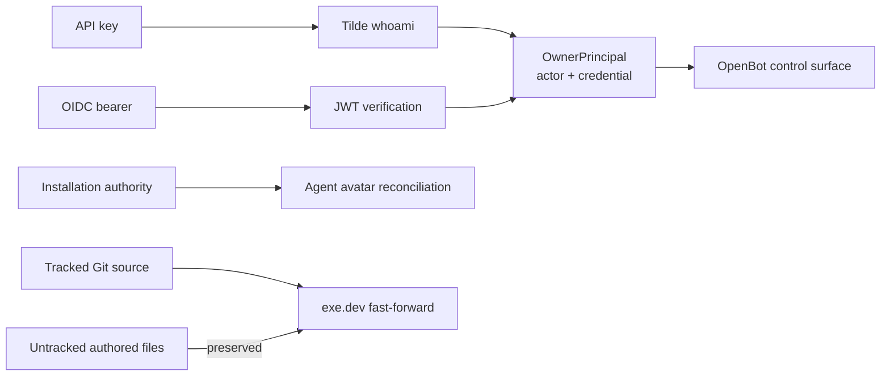

# PR 8 — production agent authentication fixes

## Intent of the change

- Let a team-linked API key operate its OpenBot installation.
- Keep actor kind separate from credential kind: human or agent; API key or bearer token.
- Let installation authority finish agent provisioning when the new agent cannot yet mutate control-plane state.
- Let exe.dev refresh tracked source while preserving untracked authored files.

## Architecture changes

- Auth provider now resolves non-JWT credentials through Tilde `whoami`.
- API key accepted only for `human` or `agent` identity linked to installation team.
- Principal carries `actorType` and `credentialType` independently.
- JWT path stays audience, client, installation, scope, signature, and time checked.
- Agent provider uploads canonical avatar with installation client, not new agent runtime key.
- exe.dev dirty check ignores untracked files; tracked edits still stop fast-forward.
- ADR-0016 records durable auth boundary.

## Summarized package changes

- `@tryopenbot/auth-provider`
  - Accept team-linked human and agent API keys.
  - Preserve OIDC bearer validation.
  - Document actor and credential classification.
- `@tryopenbot/control-service`
  - Update auth fixtures for typed principal contract.
- `@tryopenbot/agent-provider`
  - Use installation authority for canonical avatar upload.
  - Remove machine-user wording from changed surface.
- `@tryopenbot/agent-service-provider`
  - Ignore untracked files when deciding whether exe.dev tracked source may fast-forward.
- Fixed Changesets group
  - Patch release note added for coordinated workspace release.

Validation:

- Frozen pnpm install passed.
- Auth provider: 9 tests passed.
- Control service: 65 tests passed.
- Agent provider: 14 tests passed.
- Agent service provider: 19 tests passed.
- Full `pnpm check` passed.
- Full `pnpm build` passed.
- Production fresh-agent ChatKit invocation returned HTTP 200 and delivered exact visible marker through direct session-bound `sendMessage`.

## Critical to apply to forks

yes

Fork action:

- Pull this change before relying on an installation API key for control routes or fresh-agent creation.
- Keep installation team linkage present in Tilde `whoami` for every accepted API key.
- Do not replace agent runtime keys with installation credentials; only provisioning mutations use installation authority.
- If an exe.dev checkout has intentional tracked edits, commit or move them before deployment. Untracked authored files are preserved automatically.
- No state import/export, database migration, environment rename, secret migration, or manual data rewrite is required.
