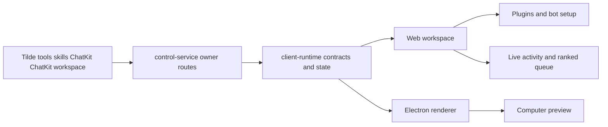

# Intent of the change

Complete the web and Electron owner workspace around plugins, bot creation, live activity, queues, and Computer preview.

- Replace the plugins prototype with a real Tilde-backed catalogue of tool accounts and authored skills.
- Assign each account or skill to specific bots and hide system-owned resources.
- Preserve selected bot identity through asynchronous setup and first-message reconciliation.
- Drive background activity, unread previews, and busy indicators from durable ChatKit workspace events.
- Queue follow-up turns by persisted rank and expose only Stop while a bot streams.
- Keep Computer preview reachable as an Electron bottom-right workspace surface.

# Architecture changes

Shared client-runtime contracts own network shapes and durable reconciliation; DOM renderers consume that state without parallel snapshots.

- Control-service keeps signed/provider calls server-side and protects plugin routes with existing owner authentication.
- `@tryopenbot/client-runtime` validates plugin snapshots, consumes durable queue/activity events, and remains framework-neutral.
- `@tryopenbot/ui` renders shared web/Electron presentation; Electron privilege stays behind its existing adapter.
- Optimistic queue rows have no durable identifiers and therefore never expose unsafe mutation controls.
- Native Expo presentation is intentionally deferred; it can consume the same shared contracts later.

# Summarized package changes

- `@tryopenbot/control-service`: adds authenticated plugin catalogue and bot-assignment routes for tool accounts and skills, including category normalization and system-resource filtering.
- `@tryopenbot/client-runtime`: adds plugin contracts, assignment client calls, durable ChatKit workspace reconciliation, persisted queue ranks, and richer agent setup state.
- `@tryopenbot/ui`: implements the real plugins catalogue, account setup and bot-selection dialogs, live agent activity, ranked queue composer, bot identity presentation, keyboard-stable account menu, and responsive workspace layout.
- `@tryopenbot/web`: connects settings and workspace routes to shared runtime behavior and preserves bot avatar/setup state.
- Browser coverage: verifies real plugin assignment, connector creation, bot creation and first send, durable activity and unread previews, queue submission, account keyboard behavior, responsive composition, and Electron Computer preview.
- Changeset: records the fixed-group minor owner-workspace capability.
- Validation: after rebasing directly onto upstream `main` containing PRs 74-78, 35 focused tests passed, `pnpm check` passed with 36 upstream warnings and no errors, `pnpm build` passed including package/CLI verification and Expo exports, and full Playwright passed 12 tests with one intentional boot-placeholder skip.

# Critical to apply to forks

yes

Forks using the owner workspace should merge this complete slice together with its normalized owner-profile dependency. Custom control-service middleware must protect `/api/plugins` and `/api/plugins/*`. Custom renderer state must continue to consume shared client-runtime contracts rather than adding a second plugin, queue, or event snapshot.

No database migration, secret, environment name, ConnectRPC schema, deployment topology, or provider resource identifier changes. Tilde account, skill, agent, session, and queue identifiers remain authoritative.

Native Expo does not yet render these new presentation surfaces. Forks requiring client parity should implement them from the shared runtime contracts and verify real workflows on an emulator. Web/Electron forks should run focused runtime/UI tests plus the complete Playwright suite after merging.
