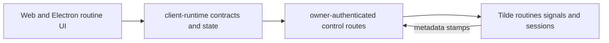

# Intent of the change

Give owners one Routines surface for recurring work triggered by a UTC schedule or a Tilde signal-provider event.

- Group schedule routines and signal rules into one owner-facing routine without adding OpenBot persistence.
- Manage signal-provider connections inline and from Settings.
- Keep routine contracts, polling, mutations, and run history in the shared client runtime.
- Render the capability in the web workspace and Electron renderer.

# Architecture changes

Tilde remains authoritative for schedules, signal rules, provider instances, and deliveries. OpenBot reconstructs each unified routine from metadata stamps on those resources.

- `apps/control-service` adds owner-protected `/api/routines/*` and `/api/signals/*` routes outside the ChatKit proxy namespace.
- `@tryopenbot/client-runtime` validates all client-consumed shapes and owns stale-while-revalidate polling and mutation reconciliation.
- `@tryopenbot/ui` provides the agent details pane, routine editor, trigger builders, provider setup, and signals settings presentation for the DOM clients.
- ADR-0031 records grouping, failure, paging, run-history, provider-setup, and cross-client decisions.
- No database, ConnectRPC, deployment-topology, or fork-configuration change is introduced.

# Summarized package changes

- `@tryopenbot/control-service`: projects unified routine CRUD and test runs over Tilde ChatKit routines and signal rules; manages provider instances and deliveries; rolls back partial creates and refuses unsafe truncation of unpaginated signal lists.
- `@tryopenbot/client-runtime`: adds routine and signal contracts, client calls, store slices, polling, cron helpers, and run-history composition.
- `@tryopenbot/ui`: adds the resizable details pane, routine overview/editor, schedule and event trigger editors, provider connection dialog, and signal settings inventory.
- `@tryopenbot/web`: adds details and signals routes, URL-addressable routine drill-in, settings navigation, and the shared UI wiring used by Electron.
- Browser coverage: opens a routine, persists its active state through the control API, and verifies the visible paused result.
- Changeset: records minor releases for the control service, client runtime, UI, and web packages.
- Validation: 58 routines/signals control-service tests passed; 71 client-runtime tests passed; 58 UI tests passed; `pnpm check` passed with 36 existing warnings and no errors; `pnpm build` passed including package/CLI verification and Android and iOS Expo exports; Playwright passed 13 tests with one existing fixme skipped.

# Critical to apply to forks

yes

Forks must run against a Tilde API that preserves `metadata` on routines and signal rules and exposes the signals provider, instance, rule, and delivery endpoints represented in the generated API client. Custom control-service authorization must protect `/api/routines`, `/api/routines/*`, and `/api/signals/*`.

Web and Electron receive the complete presentation. Shared contracts and runtime state are available to Expo, but native routines screens are intentionally deferred under ADR-0031.

<FOLLOW UP>
Owner: apps/mobile
Trigger: this routines and signals capability merges for the web and Electron clients
Work: render the routines list, editor, and provider connect flow natively against the existing client-runtime contracts, slices, and helpers using BNA UI components and React Native sheets, then prove the workflows on both Android and iOS
</FOLLOW UP>
