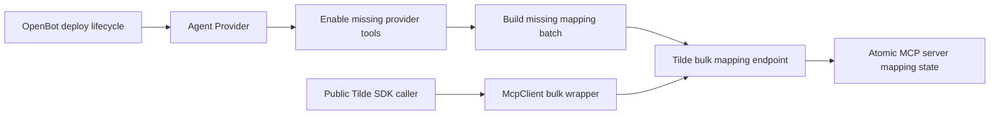

# PR 82: Batch MCP server function mappings

## Intent of the change

- Old way bad: Agent Provider map every missing Tilde control-plane function with separate HTTP request.
- Big provider mean many requests. More auth, network, database, reconciliation work. Deploy slower. Retry can stop halfway.
- New Tilde API has atomic bulk add and remove for one tool provider instance. OpenBot must use it.
- Agent Provider now enable provider tools as before, then send all missing MCP server mappings in one request.
- Public Tilde SDK now expose `McpClient.addFunctions` and `McpClient.removeFunctions` with camelCase inputs.
- Generated Tilde client refreshed from merged API main. Refresh also carries current provider-icon schema from API main.
- Evidence review used full PR diff, current task discussion, API PR 154 review findings, and available local memory summaries. Complete local thread listing was not available through a product thread API, so no claim made that every unrelated local thread was inspected.

## Architecture changes

- Ownership not move. Agent Provider still owns complete authored-agent external reconciliation per ADR-0004.
- CLI still only schedule lifecycle. No vendor CRUD move into command code.
- Generated API operations stay under `@trytilde/api-client/generated`.
- Stable SDK wrapper keeps generated snake_case details private and presents camelCase DTOs.
- Tool enablement still bounded-concurrent because Tilde bulk contract covers MCP server mappings only.
- Mapping call now one atomic request. Repeated deploy still converges: already mapped functions filtered before request, and Tilde exact retries are idempotent.
- No new provider contract, environment variable, secret, resource ID, protobuf field, route, deployment checkpoint, or client runtime state.

## Summarized package changes

- `@tryopenbot/agent-provider`
  - Replace per-function mapping concurrency loop with `bulkAddMcpServerInstanceFunctions`.
  - Keep existing provider-tool enable loop.
  - Expand reconciliation test to two control-plane functions and prove one bulk mapping request plus no second-deploy mutations.
- `@trytilde/api-client`
  - Refresh OpenAPI specification and generated client from merged Tilde API main.
  - Export generated bulk add/remove operations and request/response types.
  - Retain current provider-icon schema included by API main.
- `@trytilde/sdk`
  - Add `McpClient.addFunctions` and `McpClient.removeFunctions`.
  - Add public camelCase input types and package-root exports.
  - Test method, path, body mapping, success conversion, and conflict errors.
  - Update package README public API.
- Workspace tooling
  - Require both bulk operation IDs in the supported OpenAPI surface validator.
  - Add a Changeset for the fixed OpenBot package group, generated API client, and SDK.

Validation completed:

- OpenAPI refresh and validation: 377 operations.
- Generated client tests: 4 passed.
- SDK tests: 66 passed.
- Agent Provider tests: 15 passed.
- `pnpm check`: passed with existing repository warnings only.
- `pnpm build`: passed, including web build, iOS and Android exports, package verification, and CLI verification.
- Commit staged-file hook: passed.

## Critical to apply to forks

yes

Forks that use OpenBot's Tilde Agent Provider should take this change so large control-plane toolkits reconcile with one atomic mapping request instead of many separate requests.

Fork action:

1. Update to this OpenBot revision after the companion Tilde API bulk endpoints are available.
2. Install the updated workspace packages normally.
3. Redeploy or run the normal Agent Provider lifecycle for each authored agent.
4. Confirm the agent's runtime MCP server contains all Tilde control-plane functions.

No manual configuration, state, secret, environment, or resource migration. Existing MCP server IDs and tool provider instance IDs stay valid. Customized forks that directly called generated single-function operations may keep doing so, or move provider-account batches to the new bulk operations.
