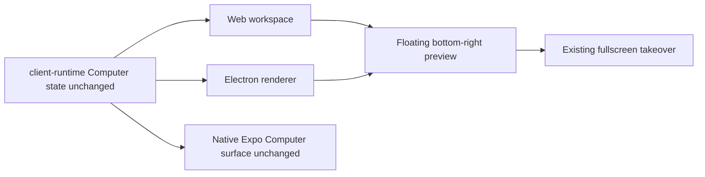

# Intent of the change

Restore the Computer preview as a floating bottom-right workspace surface.

- Stop reserving a permanent Computer column in ordinary web workspaces.
- Keep the existing 16:9 preview, explicit take-control action, fullscreen takeover, close toggle, and persisted open state.
- Place the composer beside the preview while leaving chat bounds unchanged.
- Keep compact web viewports on the existing full-height Computer takeover.

# Architecture changes

No protocol or state architecture changes. Existing web and Electron renderers select the existing floating presentation path. Shared Computer data and preview routes stay unchanged.

- `apps/web` now enables floating Computer layout for both browser and Electron renderers.
- `@tryopenbot/ui` anchors the preview to the chat pane rather than a shell-side grid column and moves the composer clear of it.
- At 720px and below, the DOM client restores a fixed full-height Computer surface so the preview does not crowd the composer.
- Layout remains presentation-only under ADR-0017. No client-runtime contract, HTTP route, ConnectRPC schema, provider lifecycle, deployment topology, configuration, secret, or persistent state changes.

# Summarized package changes

- `@tryopenbot/web`: selects the floating workspace mode for browser and Electron contexts.
- `@tryopenbot/ui`: positions the 240-320px preview 16px from the chat pane's bottom-right; moves the composer and queued-message controls clear of it; preserves compact takeover behavior.
- Browser coverage: proves ordinary web and Electron bottom-right placement, stable chat bounds, composer and queue displacement, toggle persistence, responsive fallback, and fullscreen takeover.
- Changeset: records the owner-visible fixed-group patch.
- Validation: 58 UI tests passed; 2 web tests passed; focused bottom-right and queued-message Playwright coverage passed; `pnpm check` passed with 40 existing warnings and no errors; `pnpm build` passed including package/CLI verification and Android and iOS Expo exports; full Playwright passed 13 tests with one existing boot-stage test skipped.

# Critical to apply to forks

no

No manual migration is required. Forks receive the layout through a normal upstream update. Forks with custom workspace CSS should preserve the `computer-floating` shell class, keep the preview anchored relative to `--sidebar-width`, and verify that custom composer margins do not overlap the 240-320px preview.

Expo keeps its existing native Computer surface. No fork configuration, environment, secret, deployment, or data action is required.
