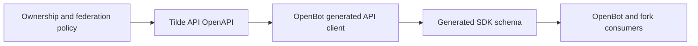

# Tilde personal resource ownership API

## Intent of the change

- Refresh OpenBot from the companion Tilde API ownership/security contract.
- Expose generated types and operations for `team`, `user`, and `user_team` resources.
- Include MCP user-tool federation policy and ownership-aware portable state mappings.
- Keep generated API code internal. No hand-authored SDK wrapper behavior changes.

## Architecture changes

The API remains the contract owner. OpenBot copies the versioned OpenAPI document and regenerates its internal client and SDK schema. Runtime resource authorization, encryption, migrations, and MCP federation stay in Tilde API.

## Summarized package changes

- `@trytilde/api-client`: regenerated for 450 API operations, including personal routes, tagged ownership, ownership changes, owner mappings, and MCP federation configuration.
- `@trytilde/sdk`: regenerated schema declarations now describe the same API surface.
- Workspace context: documents the three ownership scopes and caller-specific MCP federation boundary.
- Changesets: adds a release note for the expanded generated contract.
- No OpenBot provider, renderer, client-runtime state, CLI workflow, deployment topology, secret, or fork-owned configuration changed.

Validation completed:

- `pnpm check`
- `pnpm build`, including web, iOS, and Android bundles
- `TILDE_OPENAPI_PATH=... pnpm openbot sdk refresh`
- `pnpm openbot sdk validate`
- All five Tilde SDK package builds and tests passed.

## Critical to apply to forks

yes — forks that compile against generated Tilde API types must refresh this commit before consuming the companion API ownership/federation endpoints. Apply the generated client/spec/schema changes and the Changeset. No configuration, secret, environment, provider, or deployment migration is required. After applying, run `openbot sdk validate`, `pnpm check`, and `pnpm build`.
