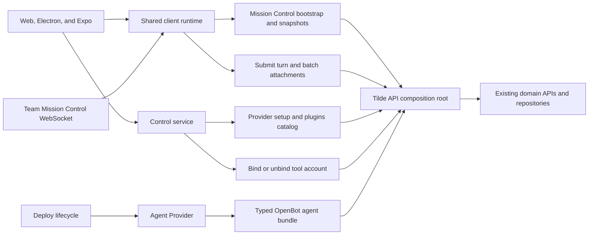

# PR 86: Consolidated Tilde workflow boundaries

## Intent of the change

- Old way bad: one owner action often caused several dependent requests from OpenBot to Tilde.
- Workspace load fetched sidebar data, then fanned out message reads for previews.
- Selecting a conversation fetched messages and queue separately. Sending a turn then refetched sidebar and queue.
- Each attachment completed separately. Connector setup manually performed credential and broker sequences, then asked the model to bind the account.
- Plugins loaded MCP, skills, provider, server, and registry inputs through seven Tilde requests.
- Agent deployment reconciled ChatKit, skills, registries, MCP servers, and bindings through a long client-controlled sequence.
- New companion Tilde API PR 157 owns these product transactions as aggregate endpoints and publishes the Mission Control WebSocket protocol as generated AsyncAPI.
- Evidence review used the complete diff, current task discussion, ADRs, API PR 157, and available local memory summaries. Complete local task listing was not available through a product task API, so this record does not claim every unrelated local task was inspected.

## Architecture changes

- One team-wide Mission Control observer remains correct because each owner client needs activity for inactive chats. HTTP owns mutations and authoritative snapshots.
- Reconnects carry the last applied durable revision through the SSE bridge so events produced while a client was offline are replayed rather than skipped.
- Client ping, server control frames, and typed server events are separate AsyncAPI operations on the same physical channel.
- Shared `client-runtime` owns identical snapshot behavior for web, Electron's renderer, and Expo.
- The control service keeps credentials server-side but no longer coordinates provider-specific credential sequences or plugin fan-out.
- Connector selection is a direct idempotent bind. It no longer spends a model turn on control-plane work.
- Agent Provider retains one lifecycle and uses the generated typed Tilde bundle operation. Existing environment and secret names remain unchanged.
- Agent retries report whether endpoint credentials remain available; Tilde replaces an unrecoverable partial agent before returning fresh one-time credentials.
- ADR-0014, ADR-0027, and ADR-0004 record the protocol, connector, and provider ownership decisions.
- No state import/export behavior changes. Mission Control revision is delivery metadata, and aggregate responses compose existing resources.

## Summarized package changes

- `@tryopenbot/client-runtime`
  - Add Mission Control bootstrap, conversation snapshot, and submit-turn contracts.
  - Remove sidebar preview, conversation, queue, and post-send fan-out reads.
  - Add batch attachment creation and preserve optimistic queue behavior.
- `@tryopenbot/control-service`
  - Use server-authored provider setup catalog/start operations.
  - Load the complete Plugins projection through one Tilde request.
  - Bind and unbind a tool account through one request each.
- `@tryopenbot/web` and Expo mobile
  - Complete attachments in batches.
  - Bind selected connector accounts directly through shared runtime behavior.
- `@tryopenbot/agent-provider`
  - Reconcile the authored agent footprint through one typed Tilde bundle call.
  - Preserve the bundled Cua fallback when a managed provider is unavailable.
- `@trytilde/api-client` and `@trytilde/sdk`
  - Refresh generated contracts from companion API PR 157.
- `@tryopenbot/connector-tools`
  - Document direct binding instead of a model-mediated selection hand-back.

Validation completed:

- `pnpm check`: passed with existing repository warnings only.
- Full workspace tests: all package suites passed except one CLI test crossed its five-second timeout under parallel load; immediate complete CLI rerun passed 173/173.
- Focused control-service tests: 59 passed.
- Focused client-runtime tests: 71 passed.
- Focused Agent Provider tests: 14 passed.
- `pnpm build`: passed, including web build, Android/iOS Expo exports, package verification, and CLI verification.
- Generated OpenAPI client refreshed from the rebased companion API branch.

## Critical to apply to forks

yes

Forks should deploy companion Tilde API PR 157 before applying this OpenBot update. The new OpenBot runtime calls aggregate routes that older API deployments do not expose.

Fork action:

1. Merge and deploy Tilde API PR 157.
2. Update the OpenBot fork and install workspace dependencies normally.
3. Redeploy the control service, web/mobile clients, and Agent Provider-managed services.
4. Run the normal Agent Provider lifecycle for authored agents.
5. Confirm Mission Control loads, a turn sends, an attachment uploads, a connector binds, and Plugins loads.

No manual state, secret, environment, or resource migration is required. Existing IDs and persisted variables remain valid.
