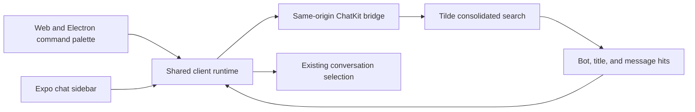

# PR 87: Consolidated ChatKit search

## Intent of the change

- Let owners search bots, conversation titles, and message content across the workspace from one surface.
- Keep search transport, validation, request ordering, and result navigation in the shared client runtime.
- Use the same capability in web, Electron, and Expo instead of introducing client-specific search contracts.
- Consume the consolidated endpoint shipped by Tilde API PR 160.

## Architecture changes

- `client-runtime` validates search responses and discards responses from superseded queries.
- Results reuse the existing sidebar and conversation state for navigation; no parallel client snapshot is introduced.
- The same-origin bridge continues to keep Tilde credentials server-side and forwards the new safe ChatKit path unchanged.
- Web and Electron extend the existing command palette. Expo adds a native search field to its chat sidebar.
- No ADR is needed because the change follows the existing client-runtime and ChatKit bridge boundaries.

## Summarized package changes

- `@trytilde/api-client` and `@trytilde/sdk`
  - Refresh generated contracts with the consolidated ChatKit search operation and result schemas.
- `@tryopenbot/client-runtime`
  - Add validated search contracts, transport, stale-request handling, and result selection.
- `@tryopenbot/ui` and `@tryopenbot/web`
  - Render bot, conversation-title, and message hits in the existing search dialog.
- Expo mobile
  - Add native workspace search and navigate selected hits through the shared runtime.
- Validation passed: generated SDK validation, 74 client-runtime tests, 58 UI tests, two web tests, workspace check, workspace build including Android/iOS exports, changeset status, and diff checks.

## Critical to apply to forks

yes

Forks must deploy Tilde API PR 160 (or a later API release containing `GET /api/v1/team/{team_id}/chatkit/mission-control/search`) before applying this update. No state, secret, or environment migration is required; redeploy the OpenBot control service and clients after updating.
