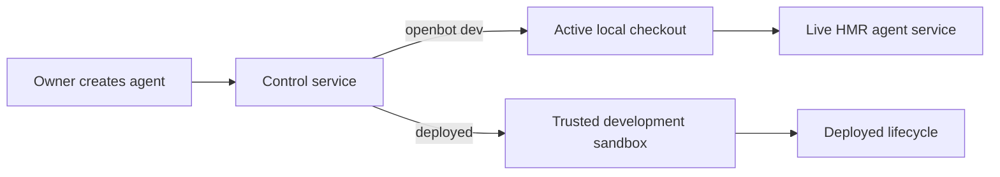

# PR 88: Local agent creation follows the active checkout

## Intent of the change

- `openbot dev` previously sent owner-created agents to the trusted development sandbox, even though the active HMR runtime belonged to the operator's local checkout.
- Local development now scaffolds into the checkout being served. Deployed control services continue to use the trusted sandbox.
- The live tunnel origin is process-owned local state, so `openbot new-agent` reconciles the new agent against the active runtime without persisting a stale deployment origin.

## Architecture changes

- Local creation inherits the explicitly running operator environment and never exposes the local checkout to production.
- Deployed creation retains its existing computer-service API key and sandbox boundary.
- `.cache/live-agent-service.json` is mode `0600`, records the owning PID, ignores dead processes, and is removed only by the lifecycle that wrote it.
- ADR-0019 records the runtime-ownership split.

Validation completed:

- Focused CLI tests: 4 passed.
- Focused control-service tests: 16 passed.
- `pnpm check`: passed with existing repository warnings only.
- `pnpm build`: passed, including package verification, CLI verification, and Android/iOS Expo exports.

## Critical to apply to forks

no

No state, secret, environment, or deployment migration is required.
