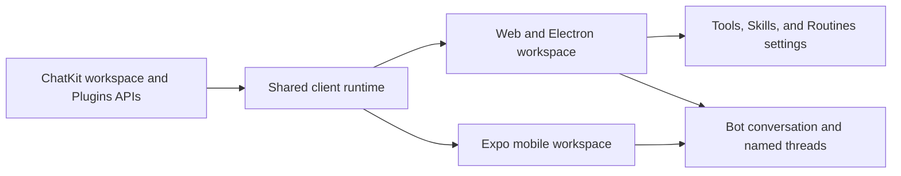

# PR 92: Workspace tools, routines, and named conversations

## Intent of the change

- Give owners dedicated Tools, Skills, and Routines settings instead of mixing those controls into chat.
- Show each bot's stable owner conversation as the bot row and show additional sessions as named threads.
- Turn raw tool activity into readable transcript narration across web and mobile.
- Keep settings navigation fast by loading agent navigation without hydrating conversations or starting the team event observer.

## Architecture changes

- `packages/client-runtime` remains the shared owner of network contracts, conversation selection, pagination, and tool-part projection.
- Web, Electron, and Expo render the same stable owner-conversation and named-thread model.
- The workspace consumes the aggregate bootstrap, conversation snapshot, submit-turn, batch-attachment, plugin catalog, provider setup, and direct connector-binding boundaries introduced by PR 86.
- Cached bootstrap previews remain visible while a selected conversation snapshot is loading.
- ADR-0023 records the presentation ownership and named-conversation split.

## Summarized package changes

- `@tryopenbot/client-runtime`
  - Add named owner-conversation/thread helpers and shared tools, skills, routines, and narration contracts.
  - Support navigation-only initialization for settings routes.
- `@tryopenbot/ui` and web
  - Add plugin catalog, connector setup, routine editing, and named sidebar presentation.
  - Preserve direct, credential-free connector binding after account selection or creation.
- Expo mobile
  - Render the shared conversation split and narrated tool activity with native components.
- Control service
  - Expose the thin plugin and connector routes consumed by the shared client.

Validation completed:

- `pnpm check`: passed with zero errors and existing repository warnings only.
- `pnpm build`: passed, including web, Android/iOS Expo exports, package verification, and CLI verification.
- Focused control-service, client-runtime, UI, and mobile projection tests passed.
- Workspace Playwright suite: 12 passed, 1 existing test skipped.
- Plugins Playwright suite: 2 passed.

## Critical to apply to forks

no

No state, secret, environment, or resource migration is required. Fork configuration, the private `trytilde/api` submodule, and the fork-only local Tilde API development workflow are intentionally excluded from this update.
