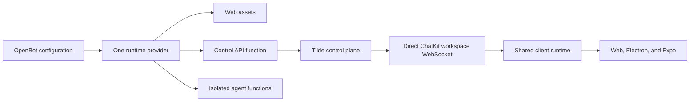

# PR 94: Consolidated runtime and direct Tilde orchestration

## Intent of the change

- Deploy web, control, and isolated authored-agent functions as one atomic OpenBot runtime.
- Replace the control service's per-session event proxy with Tilde's direct ChatKit workspace WebSocket protocol.
- Make Tilde automations and bulk provider-tool binding the authoritative orchestration boundaries.
- Preserve split-provider compatibility and make endpoint cutover safe to retry or roll back.

## Architecture changes

- `LocalRuntimeServiceProvider` and `VercelRuntimeServiceProvider` combine the existing control/web and agent builders without removing explicitly split installations.
- The deploy coordinator recognizes one provider instance composed as both services, performs one lifecycle, health-checks the combined runtime, cuts Tilde endpoints over, and only then retires the legacy local agent service.
- `packages/client-runtime` exchanges the owner session for a short-lived socket ticket, waits for one aggregate bootstrap on `chatkit.realtime.ready`, and remembers revisions only after an event is applied successfully.
- Web and Electron use exact-origin browser tickets. Expo uses the same runtime contract with the native transport classification. Electron's CSP admits only the configured Tilde WebSocket origin.
- Routine routes now translate directly to unified Tilde automations. Connector setup uses Tilde's idempotent bulk enable-and-bind operation with the agent's configured MCP server identity.
- ADR-0006, ADR-0008, ADR-0014, ADR-0016, and ADR-0031 record the changed deployment, authorization, event transport, and automation boundaries.

## Summarized package changes

- `@tryopenbot/agent-service-provider`
  - Add local and Vercel consolidated runtime providers, combined build artifacts, rollback-safe local service retirement, and focused lifecycle tests.
- Control service
  - Add authenticated ChatKit workspace ticket exchange, direct unified routine translation, and bulk connector binding; remove the `ws` dependency.
- `@tryopenbot/client-runtime`
  - Add the direct JSON-RPC WebSocket transport and aggregate ready barrier shared by every client.
- CLI and configuration templates
  - Initialize and deploy one runtime project while keeping legacy split state readable.
- Computer, auth, desktop, web, and mobile adapters
  - Align managed project ownership, access-token forwarding, CSP, and client transport classification with the consolidated boundary.
- `@trytilde/api-client` and `@trytilde/sdk`
  - Regenerate the OpenAPI surface for unified automations, ChatKit workspace tickets, and provider-tool binding.

Validation completed:

- `pnpm check`: passed with zero errors and 40 existing warnings.
- `pnpm build`: passed, including package verification and Android/iOS Expo exports.
- Full Playwright suite: 15 passed, 1 intentionally skipped.
- Desktop packaging: passed; signed ZIP and DMG produced, with notarization skipped because options were unavailable.
- Control service: 62 passed.
- Client runtime: 83 passed.
- Agent service provider: 16 passed.
- Computer service provider: 24 passed.
- Desktop tests: 6 passed.
- CLI tests: 180 passed, including 30 focused initialization tests.

## Critical to apply to forks

yes

Merge and deploy `trytilde/api#168` before adopting this update. Consolidated Vercel installations should set `VERCEL_RUNTIME_PROJECT`; the previous control project remains a compatibility read fallback. Deploy through `openbot deploy` so the combined runtime is built and health-checked, Tilde agent endpoints are cut over, `AGENT_SERVICE_ORIGIN` is persisted, and any legacy local agent service is retired in the safe order. Explicitly split installations may keep their existing provider composition.
