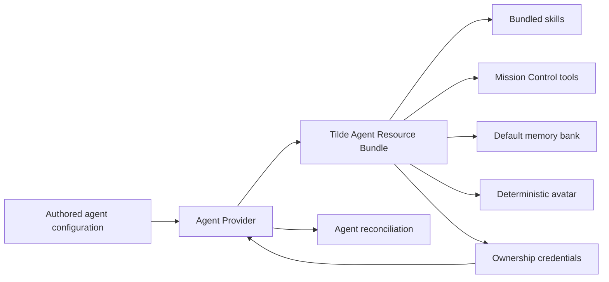

# PR 95: Durable authored-agent resource bundles

## Intent of the change

- Make one Tilde Agent Resource Bundle the durable external owner of every authored OpenBot agent's runtime resources.
- Provision and poll bundle creation before reconciling the agent, then preserve the one-time ownership credentials returned by Tilde.
- Keep bundled skills, Mission Control tools, the default memory bank, and a deterministic avatar aligned with repository-authored agent state.
- Forward the already verified owner access token when local agent creation needs to authorize the Tilde provisioning request.

## Architecture changes

- The Agent Provider now treats the bundle as the aggregate provisioning boundary instead of independently creating resources without a durable aggregate owner.
- Bundle provisioning is asynchronous: deployment starts the operation, polls it to completion, then claims credentials once and carries existing credentials forward on later reconciliations.
- Existing bundle identifiers and credentials remain valid, allowing idempotent adoption and repeat deployment without duplicating resources.
- The control service continues to verify the owner session and now forwards that verified token internally, so the agent-create path does not rediscover or trust an unverified credential source.
- ADR-0004 is amended to record the Agent Provider's ownership of the complete authored-agent resource bundle lifecycle.

## Summarized package changes

- `@tryopenbot/agent-provider`
  - Add durable bundle provisioning, polling, credential preservation, default memory-bank selection, deterministic avatar generation/upload, and focused lifecycle tests.
  - Continue reconciling repository-authored custom skills while representing the current managed-skill selection explicitly.
  - Document the aggregate bundle boundary and deployment obligations in the package README.
- Control service
  - Carry the verified owner principal and access token through Hono context and pass the token to the local agent-create operation.
  - Preserve Web-standard upstream request handling while supporting an internal authorization override.
  - Add focused tests proving verified-token preference and local create behavior.
- API client contract usage
  - Consume the durable Agent Resource Bundle and avatar operations already supplied by the current generated Tilde API client; generated files are not hand-edited.
- Changesets and architecture documentation
  - Add the package release note and amend ADR-0004 for the durable ownership boundary.

Validation completed:

- `pnpm --filter @tryopenbot/control-service test`: 63 passed.
- `pnpm --filter @tryopenbot/agent-provider test`: 14 passed.
- `pnpm check`: passed with zero errors and 40 existing warnings.
- `pnpm build`: passed, including package verification and Android/iOS Expo exports.

## Critical to apply to forks

yes

Deploy a Tilde API version containing the Agent Resource Bundle provisioning, operation polling, credential claim, and avatar endpoints from `trytilde/api#156` before applying this update. Regenerate the Tilde API client if a customized fork carries a different API contract. Preserve any existing bundle identifier and claimed ownership credentials during configuration migration; credentials are returned once and must not be discarded. Run the Agent Provider and control-service tests, then deploy through the normal `openbot deploy` lifecycle so provisioning completes before agent reconciliation. No manual database migration or new external dependency is required.
