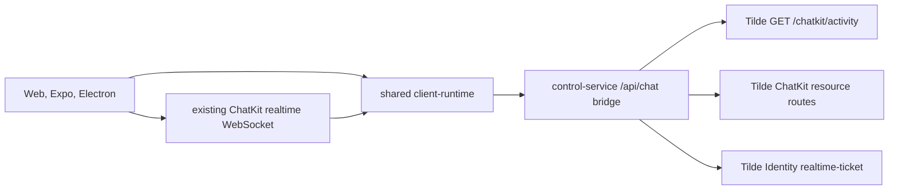

# Intent of the change

Migrate OpenBot from Tilde's removed UI-specific REST API to the regular ChatKit activity, agent, session, message, search, and turn routes in [trytilde/api#170](https://github.com/trytilde/api/pull/170). Replace `OpenBotClient.getBootstrap` with `getActivity` and make initial load plus the realtime ready barrier consume the single `GET /chatkit/activity` envelope.

Keep OpenBot's direct ChatKit realtime WebSocket URL, subprotocol ticket, typed event frames, revision cursor, reconnect behavior, and client-side event reconciliation unchanged. Move only the upstream Identity REST exchange to `/identity/openbot/realtime-ticket`.

# Architecture changes

All three clients remain behind the framework-neutral `@tryopenbot/client-runtime` contract. The runtime validates a stable activity envelope containing `activity`, `active_session_id`, and `active_conversation`; it reads agent/session navigation from the nested activity page and applies the optional conversation snapshot at the existing reconciliation boundary.

The control service continues exposing its same-origin socket-ticket boundary. Internally it calls Tilde Identity's renamed realtime-ticket route and returns the unchanged WebSocket URL and subprotocol credential. Browser Origin binding, native bearer requirements, token lifetime, single-use redemption, and authorization refresh do not change.

# Summarized package changes

- `@tryopenbot/client-runtime`: renames `getBootstrap` to `getActivity`, adopts the new activity envelope, migrates every ChatKit REST path, and preserves ChatKit realtime WebSocket handling.
- `@tryopenbot/control-service`: calls the Identity realtime-ticket route while keeping the existing owner-authenticated same-origin socket-ticket endpoint.
- `@tryopenbot/desktop`, `@tryopenbot/web`, and shared e2e fixtures: update proxied route expectations and activity/snapshot mocks. Expo receives the same behavior through the shared runtime; no renderer-specific UI changed.
- `@trytilde/api-client` and `@trytilde/sdk`: regenerate operations, types, and the schema snapshot from API PR #170.
- `packages/client-runtime/README.md` and `apps/control-service/README.md`: document the regular ChatKit activity and realtime-ticket ownership.
- ADR-0014 and ADR-0016 append the REST migration while retaining the existing owner-chat, direct WebSocket, and installation-authorization decisions.
- `.changeset/migrate-chatkit-rest-routes.md`: records the pre-1.0 breaking client method and generated operation migration for the fixed OpenBot package group and affected Tilde SDK packages.

Cross-client parity: ported through shared runtime. Web, Expo, and Electron consume the same changed interface. External dependencies, fork configuration, environment names, SOPS material, deployment checkpoints, provider reconciliation, persisted control state, and Tilde resource identity are unchanged.

Validation was intentionally limited at the requester's direction. OpenAPI generation, formatting, and the staged-file commit hook's `vp check --fix` completed. Focused tests, full `pnpm check`, build, Playwright, Electron, Expo, and e2e suites did not run.

Thread audit: the Codex app exposed all pinned/current summaries, the 50 most recent non-pinned summaries, and all 148 archived summaries across three archived pages. The non-pinned listing exposed no pagination cursor beyond its 50-item cap, so the complete local non-archived thread set cannot be proven and this record does not claim a complete thread audit. The directly relevant active realtime-remodeling task was read in detail; it is performing a separate hard cutover of ChatKit realtime vocabulary and per-user read state.

# Critical to apply to forks

yes — forks must first deploy an API release containing [trytilde/api#170](https://github.com/trytilde/api/pull/170), then update and redeploy OpenBot. Replace custom `OpenBotClient.getBootstrap` implementations with `getActivity`, return the required activity envelope, migrate any direct UI-specific REST calls, create agent sessions through canonical `POST /chatkit/sessions`, and use `/identity/openbot/realtime-ticket` for server-side ticket exchange.

No state, secret, environment, OAuth registration, provider, or database migration is required. Rollback requires reverting API #170 and this OpenBot change together. A separate active task is renaming the realtime/WebSocket contract and adding per-user session read state; forks applying both hard cutovers must rebase or resolve overlapping client-runtime, control-service, generated-contract, ADR, and fixture changes, then validate the final combined REST and realtime behavior.
