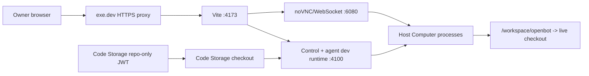

# Intent of the change

- Add optional exe.dev production. One VM. Always-on dev mode.
- Collapse runtime and Computer onto Linux host. No inner sandbox. No fake isolation.
- Use all VM CPU and RAM through ordinary host scheduling. No container quotas.
- Add Code Storage Git Provider. Setup key transient. Repo JWT retained.
- Support GitHub App continuous sync or public one-time import at repo creation.
- Keep existing Local, Vercel, and Tilde Cloud compositions unchanged.

Owner wants the smallest persistent deployment: web, control, authored agents, source checkout,
computer-service, Cua, Chromium, Xvnc, and noVNC on one exe.dev VM. This accepts one trust and
failure domain in exchange for low cost and direct live development.

# Architecture changes

- `ExeDevPlatform` owns VM name, 2-vCPU/8-GB defaults, checkout path, SSH host, public origin.
- `ExeDevRuntimeServiceProvider` resizes existing VM, exposes Vite port 4173, clones Code Storage,
  transfers private runtime configuration, installs dependencies, enables user linger, supervises
  `pnpm dev` with systemd.
- Remote bootstrap pins Node 24.20.0, pnpm 10.33.1, and checksum-verified SOPS 3.9.1; non-login SSH
  explicitly prefers that toolchain and connects to the lingering user D-Bus session.
- `HostComputerProvider` installs computer-service and desktop stack directly on host. One Linux
  user. Shared processes, files, network, environment, CPU, RAM.
- `/workspace/openbot` symlinks live runtime checkout. Agent edits hit watched source directly.
- Host Computer skips nested background orchestrator. Avoid duplicate tunnels and port conflicts.
- Vite allows exe.dev hostname and proxies `/computer-vnc/*`, including WebSocket upgrade, to
  loopback noVNC. Existing agent-scoped capability remains required.
- Initialization contract gains `transient` destination. Value reaches provider `initialize()`
  only. Never written to dotenv or SOPS.
- `CodeStorageGitProvider` uses transient organization PKCS8 key to find/create repo and mint scoped
  JWT. Persisted token grants only `git:read`, `git:write`, no force push, one repo. Code Storage
  requires `exp`; default TTL 100 years.
- Tilde clients can combine the persistent machine key with a short-lived human bearer during
  initial provisioning. The bearer is excluded from the VM environment.
- exe.dev persists its HTTPS public origin before OIDC reconciliation. Remote watched runtimes use
  that exact matching HTTPS origin for PKCE callbacks instead of trusting an internal HTTP proxy
  scheme; localhost development retains Vite callback discovery.
- Explicit `--skip-agent-reconcile` and `OPENBOT_SKIP_AGENT_RECONCILE=1` recovery controls let an
  operator bring up the owner/runtime surface while an external Tilde reconciliation is blocked.

Security trade accepted and recorded in ADR-0032: host Computer processes can reach live source and
decrypted OpenBot configuration. Untrusted third-party agents must not use this mode.

# Summarized package changes

- `packages/platform-integrations`
  - Export `ExeDevPlatform` and typed connection/configuration.
  - Contribute stable exe.dev setup questions.
- `packages/agent-service-provider`
  - Export `ExeDevRuntimeServiceProvider` and injectable command boundary.
  - Implement direct Agent/Control service lifecycle contracts and prove both at compile time.
  - Add provider-owned systemd unit and idempotent remote reconciliation script.
  - Install pinned Node 24.20.0 from nodejs.org after verifying its published SHA-256 checksum.
  - Install checksum-verified SOPS 3.9.1, select the repository pnpm version from its checkout,
    connect non-PAM SSH to the lingering user manager, and reap leaked runtime listeners.
  - Preserve dirty remote checkout; fast-forward clean checkout only.
  - Transfer ignored `configuration/.env` without committing it.
- `packages/computer-service-provider`
  - Export `HostComputerProvider` and `ExeDevComputerProvider`.
  - Build computer-service, install desktop/Cua/noVNC assets, supervise host service.
  - Build the Computer service dependency closure, skip Git submodule entries during source seed,
    rotate the read-only age identity safely, and keep each XFCE session's logs writable/private.
  - Detect the live-checkout host boundary and remove stale nested orchestrators before the outer
    development runtime owns its tunnel and ports.
  - Use same Computer and development-sandbox ID.
  - Route noVNC through public owner origin.
  - Initialize Code Storage history in trusted checkout without organization credential.
- `packages/git-provider`
  - Depend on official `@pierre/storage` SDK.
  - Export `CodeStorageGitProvider` and initialization constants/options.
  - Create optional GitHub-synced repository and persist only repo JWT.
  - Configure untracked authenticated Git remote and push named current branch.
- `packages/runtime-provider`
  - Add transient initialization value destination.
- `cli`
  - Offer `exe-dev` runtime as built-in selection.
  - Render canonical exe.dev composition with shared platform and Code Storage.
  - Keep transient answers memory-only during fresh init and reconfiguration.
  - Allow remote Vite bind host through `WEB_HOST`.
  - Add explicit production and development agent-reconciliation recovery controls.
- `apps/web`
  - Allow configured exe.dev hostname.
  - Proxy capability-scoped noVNC HTTP and WebSocket path.
- Documentation
  - Add ADR-0032.
  - Amend ADR-0019 and ADR-0020.
  - Document Code Storage GitHub App permissions, webhook, integration ordering, trust boundary.
  - Add fixed-group Changeset.
- Validation
  - Focused agent-service, computer-service-provider, git-provider, and CLI tests pass.
  - `pnpm check` passes with existing warnings only.
  - `pnpm build` passes.
  - `CI=1 pnpm test:e2e` passes 16 browser tests.
  - Production proof on `our-openbot.exe.xyz`: Code Storage fast-forward, systemd active with zero
    restarts, public root/health HTTP 200, VM Chrome-rendered sign-in UI, Computer RPC on 4101,
    noVNC on 6080, and four agent desktops ready in about one second each.
  - OAuth proof: `/auth/login` emits `https://our-openbot.exe.xyz/auth/callback`; Tilde accepts the
    registered client/redirect pair and proceeds to its login flow instead of `InvalidRequest`.

Local task audit covered every available active and archived task summary and read the relevant
OpenBot hosting, fork-update, consolidated-runtime, and pricing tasks. Durable relevant evidence:
fork-owned configuration must survive upstream updates; combined runtime already owns web/control/
agent endpoints; prior fork updates must not rewrite divergent live source. No unrelated private
task material is included here.

# Critical to apply to forks

yes

Forks selecting exe.dev must migrate intentionally:

1. Update from this upstream change and install the new lockfile.
2. Configure Code Storage GitHub App before creating a private continuously synced repo:
   Metadata read; Contents read/write; Workflows read/write when needed; Push/Create webhooks;
   webhook URL `https://<org>.code.storage/webhooks/github`.
3. Run interactive `openbot init`; select `exe.dev single VM`; provide existing VM name, sizing,
   checkout path, sync choice, GitHub owner/repo, and organization PKCS8 key in setup-only prompt.
4. Verify SOPS contains `CODE_STORAGE_REPOSITORY_TOKEN` but not
   `CODE_STORAGE_SETUP_PRIVATE_KEY` or the organization private key.
5. Custom compositions are fork-owned and will not be overwritten. Explicitly share one
   `ExeDevPlatform` between `ExeDevRuntimeServiceProvider` and `ExeDevComputerProvider`, and select
   `CodeStorageGitProvider`.
6. Ensure exe.dev SSH host trust/auth is configured. Target needs Linux, sudo, systemd user
   services, and passwordless package installation. Provider installs verified Node 24.20.0,
   pnpm 10, Chromium, Cua, Xvnc, noVNC, and desktop packages.
7. Run `pnpm deploy:prod -- --dry-run --json`, inspect VM and Git plan, then
   `pnpm deploy:prod -- --yes`.
8. Verify public `/healthz`, authenticated owner login, agent execution, Computer tool call,
   noVNC preview, WebSocket stability, systemd restart recovery, and Git push/GitHub sync.

Existing Local, Vercel, and Tilde Cloud forks need no composition migration unless they opt into
exe.dev. Every fork must understand the trust change before opting in: agents and runtime share the
host and decrypted configuration with no inner security boundary.
