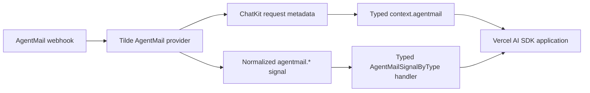

# Intent of the change

OpenBot SDK knows AgentMail shapes. Before, AgentMail ChatKit metadata stayed raw. AgentMail Signals fell through generic signal handler. Consumer had to cast JSON by hand. Now `@trytilde/sdk-vercel-ai-node` validates AgentMail input and gives strong types.

Incoming AgentMail email gives `context.agentmail`. Context includes event, inbox, thread, message, sender, subject, HTML presence, and attachments. Signals cover every AgentMail type exposed by Tilde: domain verification, message delivery lifecycle, four received variants, and three Agent Armor security events.

This change pairs with [trytilde/api#173](https://github.com/trytilde/api/pull/173). API owns AgentMail ingestion and normalized metadata. SDK owns validation and developer-facing TypeScript types.

# Architecture changes

No ownership boundary changes. One existing SDK conversion boundary learns one more provider.

Parser checks provider ID and required ChatKit metadata before promotion. Signal dispatch checks the normalized type, matching raw `event_type`, delivery ID, and required domain or message identity. Bad or unknown payload does not receive a false strong type. It follows existing generic signal fallback behavior.

ADR-0030 already puts public Tilde Vercel AI adapters in `@trytilde/sdk-vercel-ai-node`. ADR-0031 already defines normalized Signals as the boundary. No new ADR is needed.

# Summarized package changes

- `@trytilde/sdk-vercel-ai-node`
  - Exports `AgentMailChatKitMessageMetadata` and adds optional `agentmail` to `ChatKitEndpointContext`.
  - Exports AgentMail attachment, message, thread, domain, webhook-event, signal-data, signal-message, and per-type map types.
  - Adds `onUnprocessed.agentmail` with one strongly typed optional handler per supported `agentmail.*` signal.
  - Validates AgentMail provider metadata and signal payload identity before provider-specific dispatch.
  - Keeps generic signal fallback for malformed, unknown, and unhandled messages.
  - Adds endpoint-context, typed-dispatch, and malformed-payload tests.
  - Adds a minor Changeset.

Validation completed:

- Focused package check passed with existing warnings only.
- Focused package tests passed: 60 tests.
- Focused package build passed.
- Repository `pnpm check` passed with existing warnings only.
- Repository `pnpm build` passed with existing bundle-size warnings.

No protobuf, HTTP route, persisted state, deployment, credential, secret, dependency, frontend, desktop, or mobile behavior changes.

# Critical to apply to forks

no — fork configuration and deployment need no migration. Forks can consume the new AgentMail types after updating to the package release. AgentMail functionality also requires the provider API from `trytilde/api#173` to be deployed.
